<!--
  PROFILE README
  Repo: github.com/alsabbir128/alsabbir128
-->

<!-- hero: monochrome ASCII portrait (types in) beside the extruded 3d ascii
     wordmark (wipes in left-to-right, then rocks on its vertical axis).
     widths are picked so both panels land at the same visual height. -->

<h3><code>alsabbir128@github ~ $ whoami</code></h3>

<table>
<tr>
<td valign="top"></td>
<td valign="top"></td>
</tr>
</table>

 
 

<!-- animated contribution graph: real data, boxes reveal cell by cell
     (regenerated daily by .github/workflows/update-profile-art.yml) -->

<h3><code>alsabbir128@github ~ $ ./contributions.sh</code></h3>

 
 

<h3><code>alsabbir128@github ~ $ ./links.sh</code></h3>

<b>Web Developer · Coding</b>

 

## 💫 About Me:

- 🔭 I’m currently working on Web Developing. - 🌱 learning from programming hero And NSU. - 👯 I’m looking to collaborate on different projects. - 💬 U can communicate with me about things u are interested to know about. - 📫 How to reach me: (FB) [https://www.facebook.com/al.sabbir.39]
  

## 🌐 Socials:
 [] [] 

# 💻 Tech Stack:
                

# 📊 GitHub Stats:
 
 

## 🏆 GitHub Trophies

### ✍️ Random Dev Quote

### 🔝 Top Contributed Repo

---

<!-- Proudly created with GPRM ( https://gprm.itsvg.in ) -->

