<!--
  PROFILE README
  Repo: github.com/alsabbir128/alsabbir128
-->

  

  
  

 

<!--- title --->

  <ul align="center">
    
<h1 style="display: inline-block">Hi 👋, I'm Al Sabbir</h1>

    <!--- typo --->
   
  </ul>

 

<table>
<tr>
<td width="60%" valign="top">

### 💫 About Me:
- 💻 Role: Web Developer building responsive and reliable digital experiences.
- 🏍️ Exploring: I am exploring NEXT.JS , Typescript.
- 📖 Background: Sharpening skills through NSU and Programming Hero.
- ⚡ Open for: Collaborative coding, open-source projects, and new builds.
- 🗣️ Topics: Let’s talk development, software ideas, or learning journeys.
- ✉️ Ping Me: abdullahals128@gmail.com

</td>
<td width="40%" align="center" valign="top">

 

</td>
</tr>
</table>

<h3 align="left">Skills and Tools:</h3>

                 

<h3 align="left">Connect with me:</h3>

<b><h3 align="left">More About Me:</h3></b>

 

# 📊 GitHub Stats:

  

 
 
 

### ✍️ Random Dev Quote

### 🔝 Top Contributed Repo

---

<!-- Proudly created with GPRM ( https://gprm.itsvg.in ) -->

